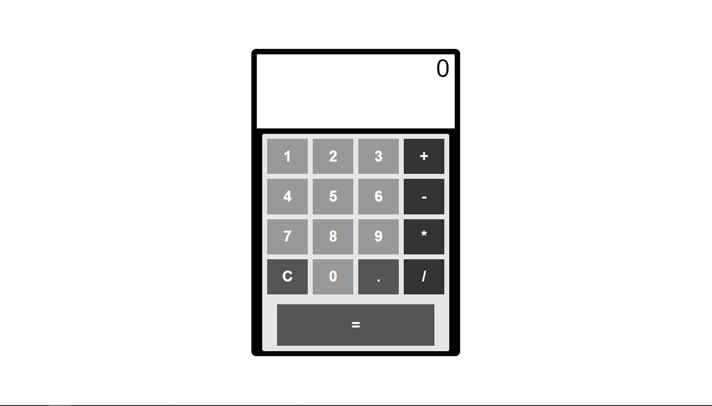
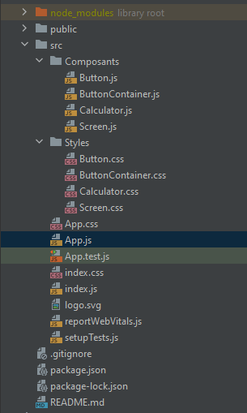

# CalculatriceJS

## Description

Ceci est un projet de calculatrice en JavaScript avec React.

## Installation

Pour installer le projet, il faut cloner le repository, puis lancer la commande `npm install` pour installer les dépendances.

## Utilisation

Pour lancer le projet, il faut lancer la commande `npm start`.

## Auteurs

-   [Alipio SIMOES](https://github.com/Redstoneur)

## Capture d'écran

1. Capture de l'application :

    

2. Capture des dossiers avec les composants :

    